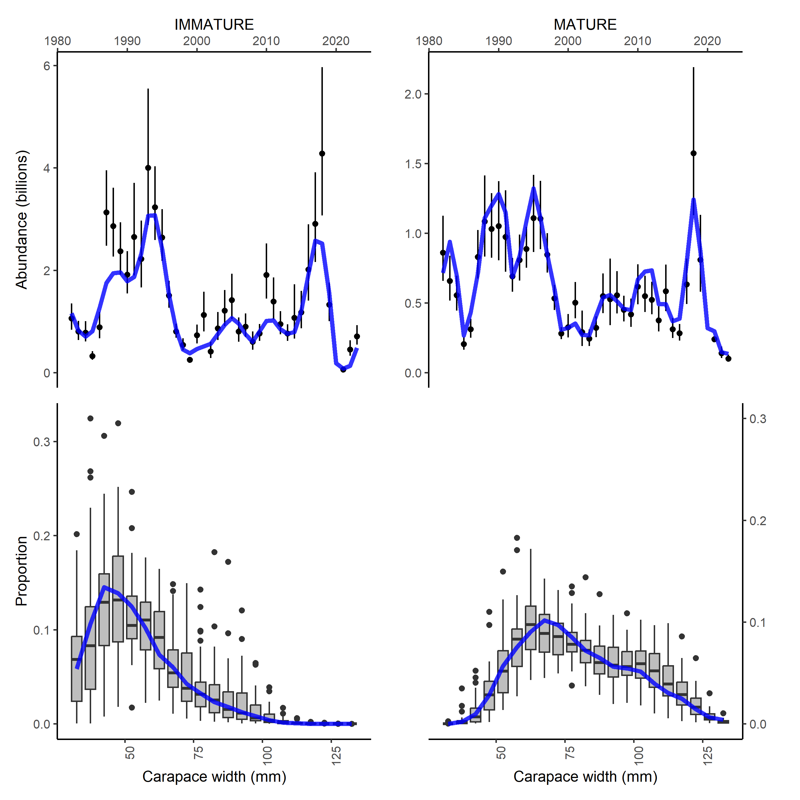
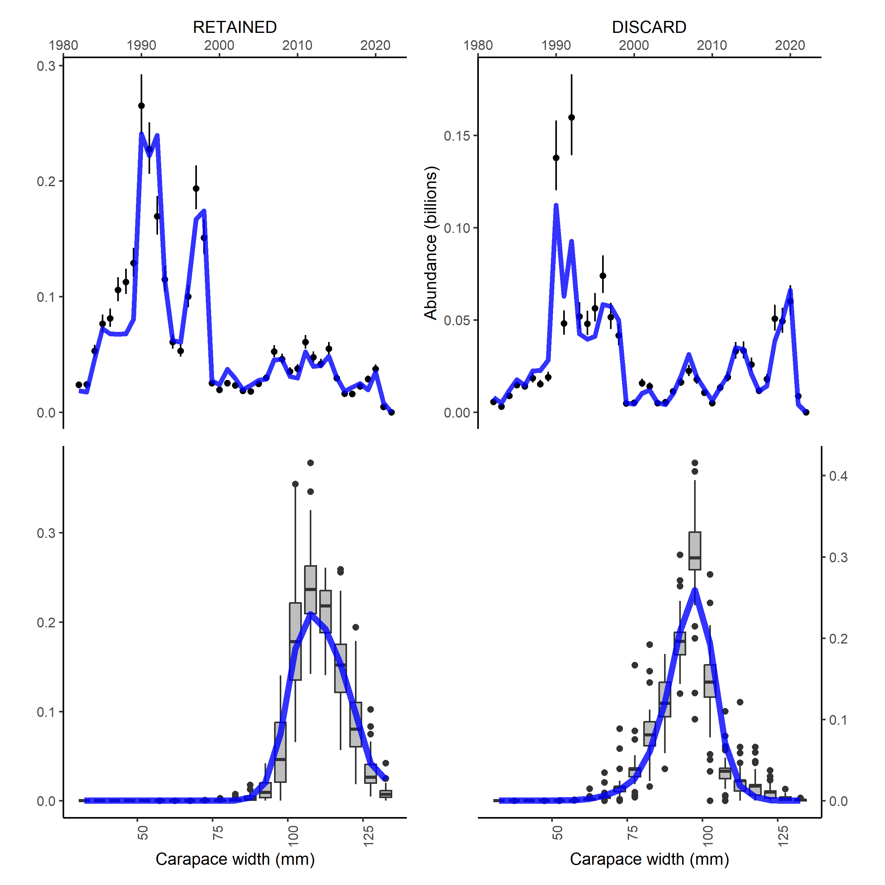
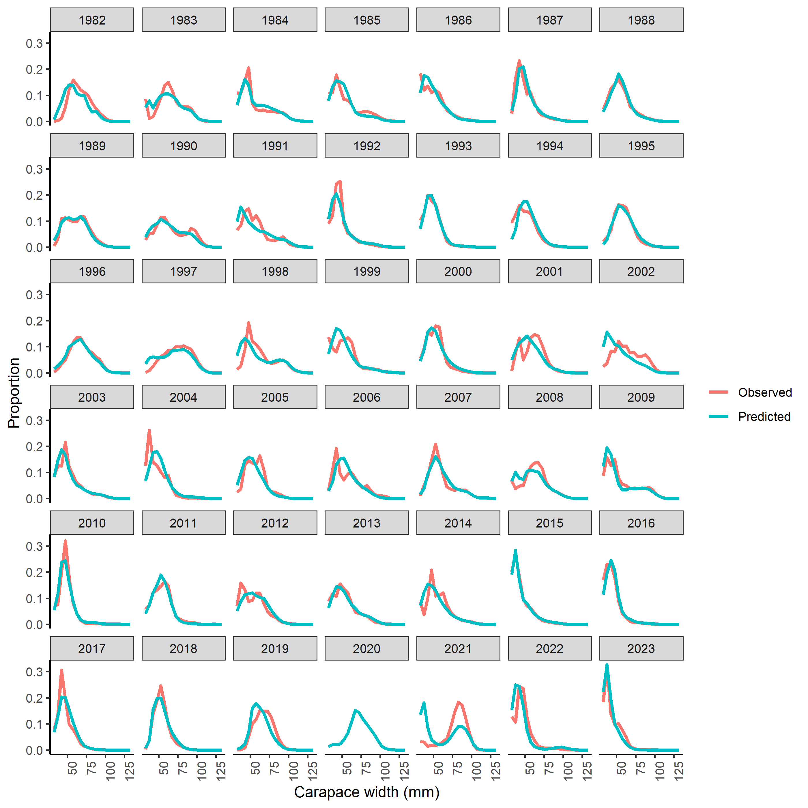
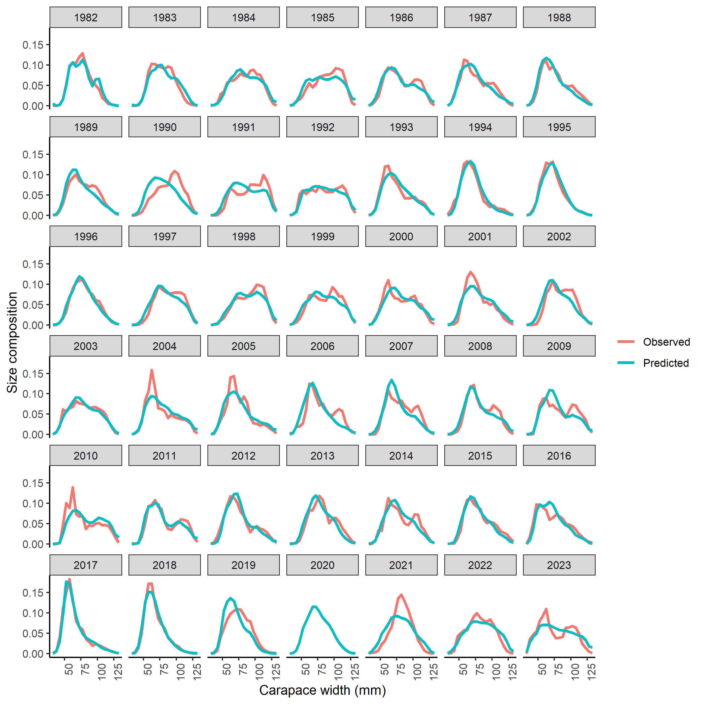
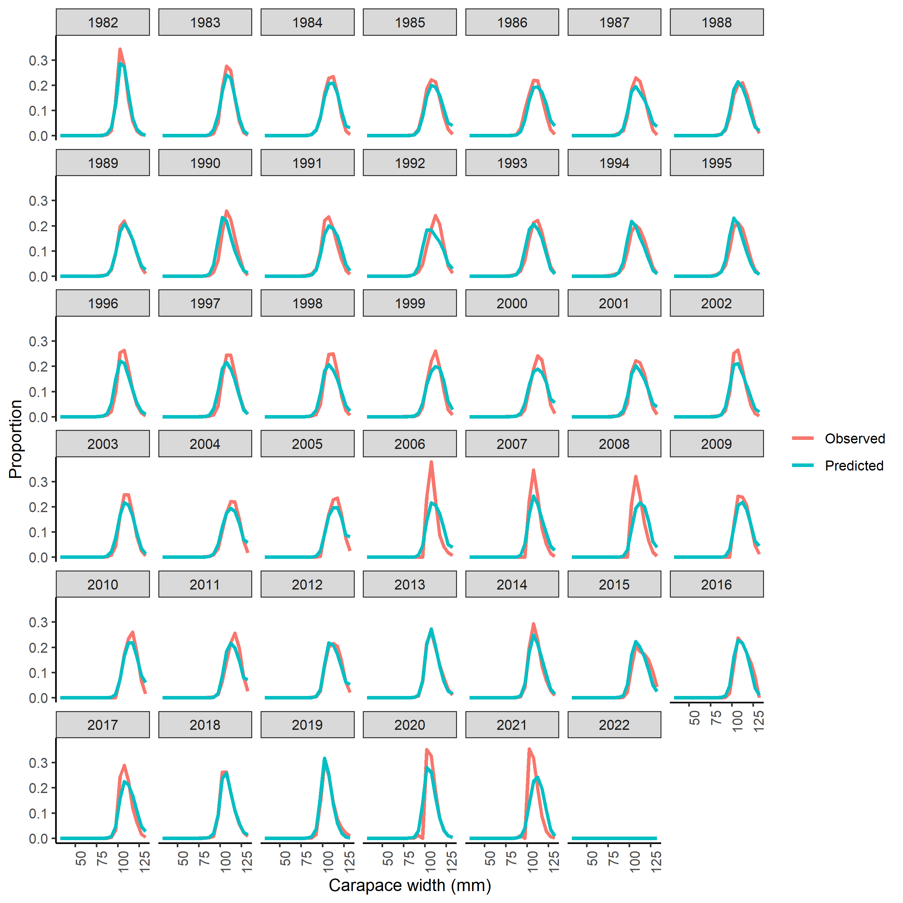
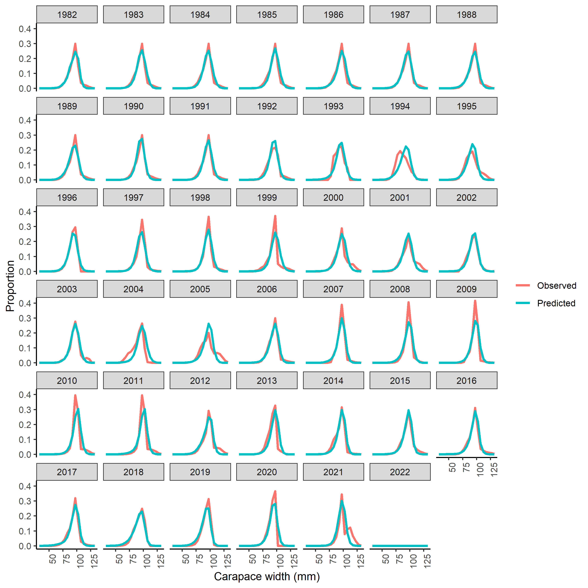
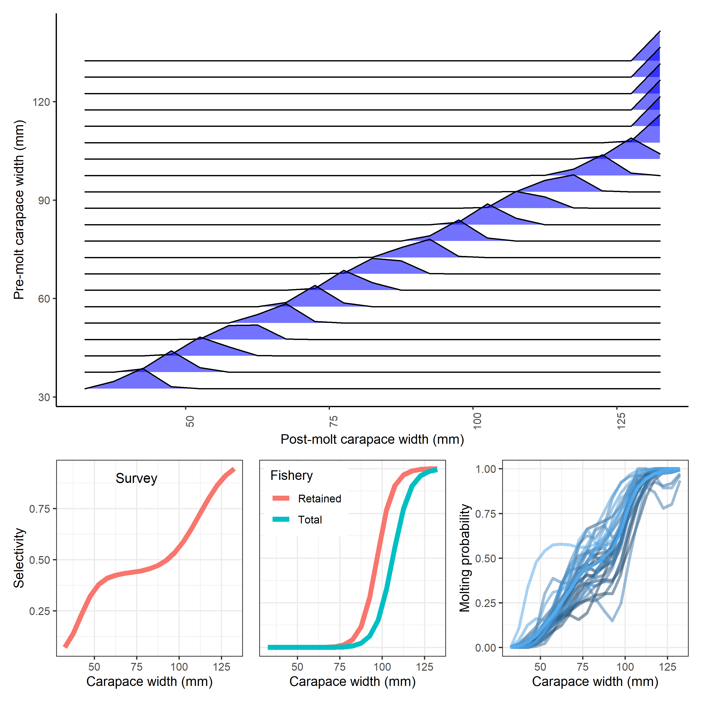

```{r, include=FALSE}

knitr::opts_chunk$set(echo=FALSE,message=FALSE,warning=FALSE)

library(plyr)
library(dplyr)
library(knitr)
library(ggplot2)
library(PBSmodelling)
library(pander)
library(coda)
library(maps)
library(lattice)
library(PBSmapping)
library(mapdata)    #some additional hires data
#library(maptools)   #useful tools such as reading shapefiles
library(mapproj)
library(plotrix)

library(ggridges)
library(reshape2)
library(miceadds)


#tinytex::install_tinytex()

```


## Methods overview

## Assessment data
### Eastern Bering Sea
### Newfoundland
### Gulf of St Lawrence
### Korea
### Barents Sea
### Japan
### Russia/Greenland?

## Population dynamics model
### Size structured population
The population dynamics model presented here incorporates the best available information on relevant population processes. The model tracks numbers of male crab at size (s) (and maturity state (m) for Chionoecetes) over time ($N_{t,s,m}$) with 5 mm size bins over different ranges of sizes for each population (\autoref{}).  Other mortality (M) is estimated by year (y) (and maturity state (m) for Chionoecetes); fully-selected fishing mortality (F) is estimated by year (y). Other estimated parameters include the initial numbers at size by maturity state, an average recruitment, yearly recruitment deviations, a vector of scalars that determine the proportions of estimated recruitment split into the first three size bins, fishery selectivity, and survey selectivity (see \autoref{} for a list of what parameters are estimated for each stock. Parameters determining growth and maturity are estimated outside of the model based on available data from stock assessments. The timing of the fishery is different for each population and is denoted by the month in which it occurs (q below). Mortality is the only population process that occurs during the first several months of a given year (the crab year begins in July with the bottom trawl survey):

 \begin{equation} N_{t=y+q/12,s,m} = N_{t=y,s,m}e^{-(\frac{q}{12})M_{t,s,m})}
  \end{equation}
  
Fishing occurs as a pulse fishery in which the crab captured and brought on deck of fishing vessels ($C_{cap}$) are a function of capture selectivity ($S_{cap}$), the number of crab in the Bering Sea at the time of fishing, and the fishing mortality applied ($F_{t}$). A retention ogive ($S_{ret}$) is applied to the captured crab to determine what fraction of crab at a given size are retained for sale ($C_{ret}$) and what fraction are discarded back into the ocean ($C_{disc}$). A discard mortality ($d_{mort}$) of 25% is applied to the crab returned to the ocean. 

 \begin{equation}  C_{cap,y} = n_{t=y+q/12,s,m}(1-e^{-F_{t}*S_{cap}})  \end{equation}
 \begin{equation}  C_{ret,y} = C_{cap,y}*S_{ret} \end{equation}
 \begin{equation}  n_{t=y+q/12,s,m} = n_{t=y+q/12,s,m}e^{-F_{t}*S_{cap}} + n_{t=y+q/12,s,m} + (1-d_{mort}) C_{cap,y} (1-S_{ret})   \end{equation}
 
Capture selectivity and retention selectivity are logistic functions of size in which the slope and size at which 50% selectivity are estimated (two time-invariant parameters for each ogive). 
  
   \begin{equation}  S_{cap,s} = \frac{1}{1+exp(-S_{slope,cap}(size(s)-S_{50,cap}))}  \end{equation}
   \begin{equation}  S_{ret,s} = \frac{1}{1+exp(-S_{slope,ret}(size(s)-S_{50,ret}))}  \end{equation}  
   
Growth occurs after fishing and is represented in the model by multiplying the vector of immature crab at size by a size-transition matrix $X_{s,s'}$ that defines the size to which crab grow given an initial size. this process results in two temporary vectors of numbesr at siez for Chionoecetes species where immature crab are denoted by the subscript m=1 and mature by m=2. 


 \begin{equation}  n_{t=y+q/12,s,m=immature} = z_{s}(1-\rho_{y,s}) X_{s,s'} n_{t=y+q/12,s,m=1}   \end{equation}
 \begin{equation}  n_{t=y+q/12,s,m=mature} = z_{s}\rho_{y,s} X_{s,s'} n_{t=y+q/12,s,m=1} + (1-z_{s})n_{t=y+q/12,s,m=2}     \end{equation}
 
A single equation can describe king crab speices given the lack of a terminal molt: 

\begin{equation}  n_{t=y+q/12,s} = (1-z_{s}) X_{s,s'} n_{t=y+q/12,s} + z_{s} X_{s,s'} n_{t=y+q/12,s}   \end{equation}

The size transition matrices $X_{w,w'}$ used here were constructed using growth increment or tagging data collected over several years (see assessments for a summary) to estimate a linear relationship between pre- and post-molt carapace width, ($\hat{W}^{pre}_{w}$ and $\hat{W}^{post}_{w}$, respectively) and the variability around that relationship was characterized by a discretized and renormalized normal distribution, Y~*w,w'*~, where *w* and *w'* represent entries in the rows and columns of the matrix.

 \begin{equation} X_{w,w'} = \frac{Y_{w,w'}}{ \sum_{w'} Y_{w,w'}}\end{equation}

 \begin{equation} Y_{w,w'} = (\bar{W}_{w'} + 2.5 - W_{w})^{\frac {\hat{W_{w}}-(\bar{W}_{w}-2.5)}{ \beta}} \end{equation}

 \begin{equation}
  \hat{W}^{post}_{w} = \alpha_ + \beta_{1}\hat{W}^{pre}_{w}
 \end{equation}

Where $\alpha$, $\beta$, and $\beta_{1}$ are parameters estimated outside of the population dynamics model. 

The probability of maturing ($\rho$) and molting probability (z) are handled differently for king crab vs. Chionoecetes species. Chionoecetes species have a terminal molt to maturity, after which they do not grow again (Tamone et al. 1995). The probability of maturing is based on the observed ogives of the proportion of mature new shell males by size calculated from chelae height measured in the NMFS survey data (Richar and Foy, 2022). These observed probabilities of having undergone terminal molt are input as data in the model. All immature individuals of Chionoecetes species are assumed to molt (i.e. z = 1). King crab do not have a molt to maturity, but the probability of molting varies with size. Here, a declining logistic function was estimated for each king crab species within the model:

   \begin{equation}  z_{s} =1 - \frac{1}{1+exp(-m_{s}(size(s)-m_{50}))}  \end{equation}  


Where the size at 50% molting probability is *m_{50}* and the slope of the logistic function is *m_{s}*. Recruitment by year was estimated as a vector of deviations ($\tau_{y}$) around a mean ($\mu$) in log space and added to the first three size of classes of crab based on another vector that is determined by the estimated parameters $\delta_{s}$ with bounds 0-200 and determines the proportion allocated to each size bin $\psi_{s}$.

 \begin{equation} tot_d = 20 + \delta_{1} + \delta_{2} \end{equation}
 \begin{equation} \psi_{1} = \frac{20}{tot_d} \end{equation}
 \begin{equation} \psi_{2,3} = \frac{\delta_{d}}{tot_d} \end{equation}
 \begin{equation}  n_{(t=y+q/12,s=1-3,m=1)} = n_{(t=y+q/12,s=1-3,m=1)} + \psi_{s} e^{\mu+\tau_{y}}    \end{equation}

Finally, the remaining other mortality is applied to the population after growth, molting, recruitment, and fishing occurs. Note that this allows a crab to experience two different mortalities within a given year as it undergoes terminal molt. 

 \begin{equation} N_{t=y+1,s,m=1} = n_{t=y+q/12,s,m=1}e^{-\frac{12-q}{12}M_{t,s,m}}  \end{equation}
 \begin{equation} N_{t=y+1,s,m=2} = n_{t=y+q/12,s,m=2}e^{-\frac{12-q}{12}M_{t,s,m}}  \end{equation}


### Objective function
### Penalties and priors

## Generalized additive models
### Structure

## Model fits and diagnostics
### Population dynamics models convergence
### GAM convergence
### Eastern Bering Sea
### Newfoundland
### Gulf of St Lawrence
### Korea
### Barents Sea
### Japan
### Russia/Greenland?

## Next steps and caveats


\newpage

```{r, echo=FALSE,warning=FALSE,message=F,out.width="100%",fig.cap="\\label{ebs_ind} Fits to surveys from eastern Bering Sea."}



```

\newpage

```{r, echo=FALSE,warning=FALSE,message=F,out.width="100%",fig.cap="\\label{ebs_cat} Fits to fishery data from eastern Bering Sea."}



```

\newpage

```{r, echo=FALSE,warning=FALSE,message=F,out.width="100%",fig.cap="\\label{ebs_size_imm} Fits to immature survey size data from eastern Bering Sea."}



```

\newpage

```{r, echo=FALSE,warning=FALSE,message=F,out.width="100%",fig.cap="\\label{ebs_size_mat} Fits to mature survey size data from eastern Bering Sea."}



```

\newpage

```{r, echo=FALSE,warning=FALSE,message=F,out.width="100%",fig.cap="\\label{ebs_size_ret} Fits to retained size data from eastern Bering Sea."}



```

\newpage

```{r, echo=FALSE,warning=FALSE,message=F,out.width="100%",fig.cap="\\label{ebs_size_disc} Fits to discarded size data from eastern Bering Sea."}



```

\newpage

```{r, echo=FALSE,warning=FALSE,message=F,out.width="100%",fig.cap="\\label{ebs_est} Fits to discarded size data from eastern Bering Sea."}



```


